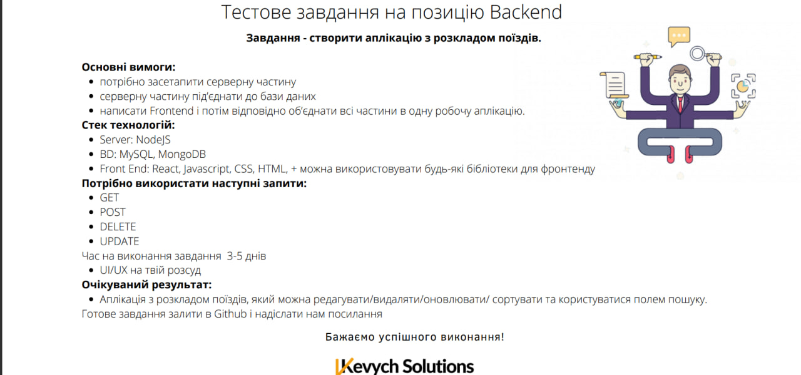

# Test task

You can see my pet project with the same requirements as this test task:

### The goal of the work was to develop a full-fledged website with support for client-server technologies. The following items were successfully implemented:

1. Authorization: the user is given the opportunity to register on the website or log in with an existing account
2. Error processing: when entering incorrect data, passwords, registration or posting of a portfolio, or entering an unexpected slush website, the corresponding error window is displayed
3. Working with the database: when registering, adding a portfolio, and saving products in Favorites or contacts with others - information is stored in the database data and is easily accessible for further actions
4. Product posting: every registered user has the opportunity to add many portfolios with a photo, description of expected salary, and supporting information
5. Contacting others SendinBlue: users have the ability to browse portfolios of other candidates, but editing and deletion are allowed only by the owner of the product. If the user found something interesting product, he can add it to his favorites and contact them later by pressing only one button, and the program itself will send an email to the user with the required information. There is a story page implemented for sent SMS and the possibility of cleaning
6. Password recovery: a special button has been developed that sends a confirmation by mail about recovery, if nothing after a certain time has changed - the password remains, otherwise, the user is logged out to the password recovery page
7. Author's page: each user has a separate place where he can change information about himself or add it

### The latest changes were to log in to the site using Google Auth; sharing products to social media and more, as you can see on my GH:

https://github.com/vasyl1312/first_pet
P.S.: Hosting doesn't work correctly at all yet

